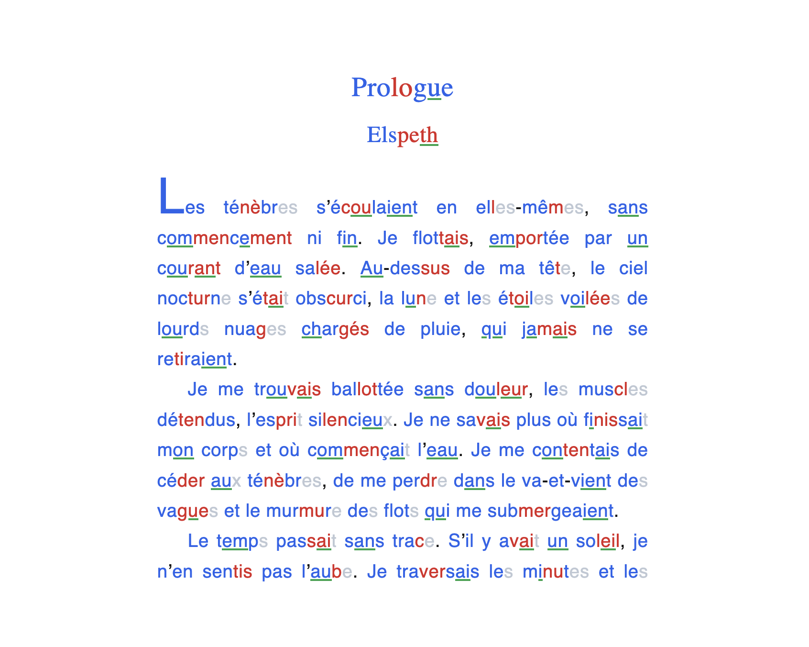

# DysReader

**DysReader** est un lecteur d'EPUB statique, gratuit et 100 % exécuté côté client, conçu pour offrir des aides visuelles et cognitives avancées aux personnes dyslexiques ou en situation de fatigue visuelle.

<div align="center">
  
</div>

---

## 🚀 Accéder à l'application (Utilisation Immédiate)

**Aucune installation n'est requise sur votre ordinateur ou votre tablette.** L'application fonctionne directement dans votre navigateur internet :

👉 **[CLIQUEZ ICI POUR OUVRIR DYSREADER EN LIGNE](https://Newzura.github.io/DysReader/)**

*Sélectionnez (en cliquant) ou glissez-déposez simplement vos fichiers EPUB sur la page d'accueil pour commencer à lire. Vos livres restent stockés localement et de manière confidentielle sur votre appareil.*

---

## 🛠️ Technologies & Architecture

* **Moteur de rendu :** [Foliate-JS](https://github.com/johnfactotum/foliate-js) pour la gestion des fichiers EPUB, XHTML et de la pagination.
* **Synthèse Vocale (TTS) :** [Transformers.js](https://huggingface.co/docs/transformers.js/index) (v3.8.1) exécutant localement le modèle neuronal **Supertonic 3** (`onnx-community/Supertonic-TTS-2-ONNX`) en WebAssembly ou WebGPU.
* **Stockage local :** IndexedDB pour la persistance de votre bibliothèque de livres et de vos marque-pages.
* **Compression :** JSZip pour la décompression et la manipulation à la volée des archives EPUB.

---

## ✨ Fonctionnalités Actuelles

### 👁️ Aides Visuelles Dyslexie (Entièrement paramétrables)
* **Colorisation syllabique :** Alternance de couleurs personnalisées pour segmenter les syllabes.
* **Grisage des lettres muettes :** Atténuation de l'opacité des lettres silencieuses pour faciliter le décodage.
* **Stabilisation des digrammes :** Soulignement visuel des sons complexes (ch, ph, ou, eau, etc.).
* **Règle de lecture & Focus ligne :** Guides visuels translucides pour maintenir le fil de lecture sans saut de ligne.

### 🎙️ Mode Mains-Libres (Commandes Vocales)
* **Contrôle par la voix :** Activez le micro en un clic pour faire défiler vos pages (« Suivant », « Précédent ») ou afficher vos « Réglages » sans toucher l'écran.

### 🔊 Synthèse Vocale Neurale (100 % locale, hors-ligne)
* **Qualité Studio (44.1 kHz) :** Intégration du modèle Supertonic 3 offrant une voix claire et naturelle, exempte de l'effet métallique des TTS légers classiques.
* **Double Buffering (Expérimental) :** Un système de tampon asynchrone génère en tâche de fond la phrase suivante pendant que vous écoutez la phrase courante pour réduire le délai d'attente habituel de 3 secondes entre les paragraphes.
* **Pagination automatique (En cours d'optimisation) :** Le moteur s'appuie sur une détection physique de visibilité des éléments pour tourner automatiquement les pages virtuelles de Foliate-JS. Cette fonctionnalité reste expérimentale et peut présenter des latences de synchronisation ou des sauts selon le format de l'eBook ou le navigateur utilisé.

---

## 🚀 Fonctionnalités en cours d'intégration (WIP)

### 📄 Convertisseur EPUB vers PDF Dys (⚠️ Expérimental / Désactivé)
Le format EPUB colorisé n'étant pas pris en charge par les liseuses tierces (Kindle, Apple Books, Kobo), nous travaillons sur un **compilateur PDF local** directement depuis la page d'accueil.
* **État actuel :** Cette fonctionnalité est **actuellement instable et désactivée** dans l'interface en raison de bugs de rendu (génération de pages blanches ou sauts de chapitres). Elle est en cours de correction.
* **Le concept prévu :** Permettre de sélectionner un livre pour fusionner ses chapitres, lui appliquer vos styles DYS actifs (polices, interlignes, couleurs) et l'exporter en PDF haute-fidélité.

---

## 💻 Pour les développeurs (Développement local, Fork & Contribution)

*Cette section s'adresse uniquement aux développeurs qui souhaitent cloner, modifier ou héberger eux-mêmes le code source du projet. Elle n'est pas nécessaire pour une simple utilisation.*

Pour cloner et lancer l'application en local sur votre machine avec un serveur de développement à chaud :

1. **Clonez le dépôt de votre projet sur votre ordinateur :**
   ```bash
   git clone https://github.com/Newzura/DysReader.git
   ```

2. **Placez-vous à la racine du dossier du projet :**
   ```bash
   cd DysReader
   ```

3. **Installez l'ensemble des dépendances du projet :**
   ```bash
   npm install
   ```

4. **Lancez le serveur de développement local (Vite) :**
   ```bash
   npm run dev
   ```

5. **Générez le build de production (le dossier `./dist` statique compilé) :**
   ```bash
   npm run build
   ```

   ---

## 📝 Suivi des modifications

* [x] **Correction des problèmes d'affichage sur appareil portable** (Ajustement de l'en-tête immersif et des marges adaptatives de Foliate-JS).
* [x] **Refonte complète de l'en-tête (Header) et du pied de page (Footer)** : Passage sur une structure en grille asymétrique (CSS Grid). Le titre et la pagination ne chevauchent plus jamais les boutons d'actions, peu importe la taille de l'écran.
* [x] **Optimisation UI/UX pour smartphone** : Sur mobile, l'en-tête bascule automatiquement sur deux lignes (Row 1 : boutons de retour et de réglages, Row 2 : titre de l'œuvre sur toute la largeur) grâce aux CSS Grid Areas.
* [x] **Résolution du bug de vitesse macOS** : Implémentation d'une machine à états séquentiels pour la synthèse vocale, empêchant les superpositions et accélérations incontrôlées sous Safari et Chrome Mac.
* [x] **Liaison dual-voice & normalisation de texte** : Gestion des pauses respiratoires par la ponctuation, conversion des chiffres/abréviations en toutes lettres, et alternance automatique de voix pour les dialogues.
* [x] **Intégration du mode mains-libres** (Contrôle et navigation de la liseuse par la voix).
